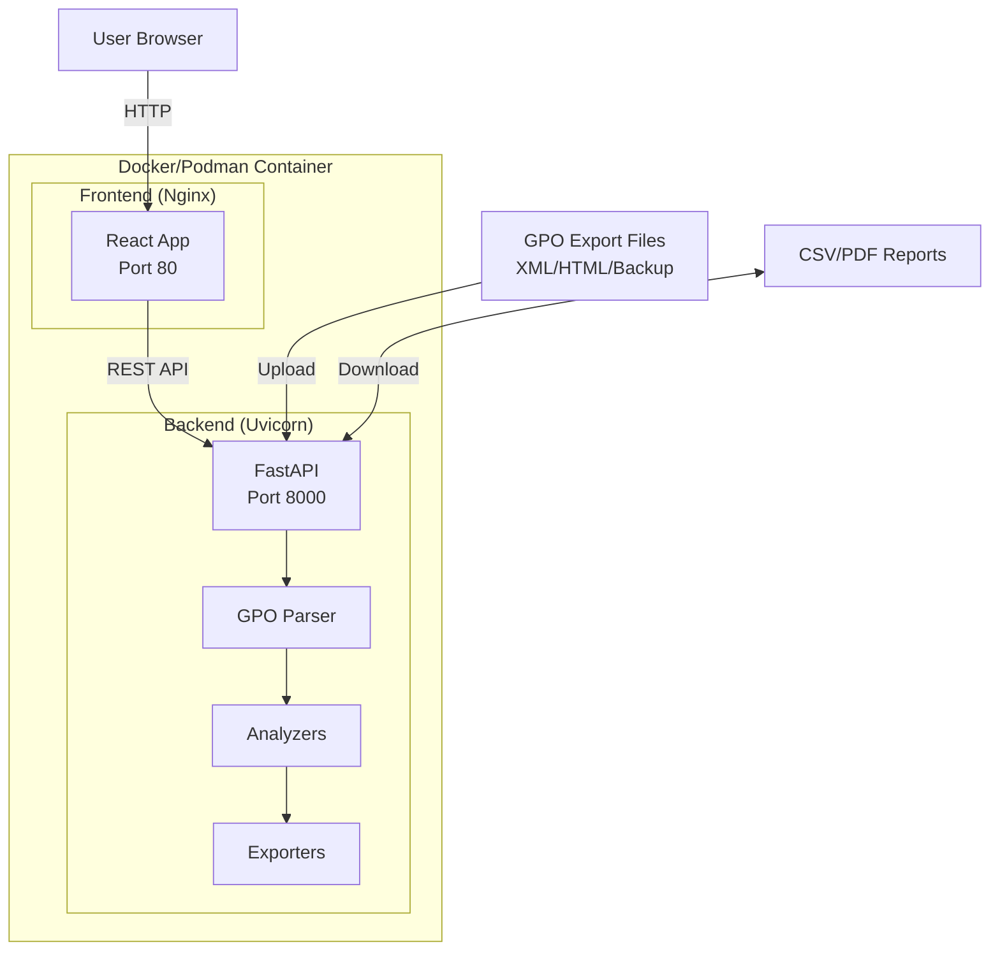

# Active Directory GPO Analysis Tool

A cross-platform, containerized tool for analyzing Group Policy Objects to detect conflicts, duplicates, and provide improvement recommendations with export capabilities and a modern UI.

## User Review Required

> [!IMPORTANT]
> **Data Input Method**: The tool will work with **exported GPO data** (XML/HTML reports from `gpresult`, `Get-GPOReport`, or SYSVOL backup files) rather than live AD connections. This allows:
>
> - Cross-platform operation (no Windows-only AD dependencies)
> - Analysis of GPO backups without AD access
> - Security (no credential handling needed)
>
> **Please confirm this approach works for your use case.**

> [!NOTE]
> **Technology Stack Choices**:
>
> - **Backend**: Python 3.12 + FastAPI (excellent XML parsing, async support)
> - **Frontend**: React 18 + Vite (modern, fast, premium UI)
> - **Container**: Multi-stage Docker build (works with both Docker and Podman)
> - **PDF Export**: WeasyPrint (CSS-based, professional reports)
>
> Let me know if you prefer different technologies.

---

## Proposed Changes

### Container Infrastructure

#### [NEW] [Dockerfile](file:///d:/github/GPOanalysis/Dockerfile)

Multi-stage build for minimal image size:

- **Stage 1**: Build frontend (Node.js)
- **Stage 2**: Build backend dependencies (Python)
- **Stage 3**: Production image (~200MB) with Nginx + Uvicorn

#### [NEW] [docker-compose.yml](file:///d:/github/GPOanalysis/docker-compose.yml)

Local development configuration with:

- Hot-reload for development
- Volume mounts for GPO data
- Environment variable configuration

#### [NEW] [.containerignore](file:///d:/github/GPOanalysis/.containerignore)

Optimized build context for faster builds

---

### Backend (Python/FastAPI)

#### [NEW] [backend/app/main.py](file:///d:/github/GPOanalysis/backend/app/main.py)

FastAPI application entry point with CORS, static files, and API router

#### [NEW] [backend/app/models/gpo.py](file:///d:/github/GPOanalysis/backend/app/models/gpo.py)

Pydantic models for:

- `GPOInfo`: Basic GPO metadata (name, GUID, links, status)
- `PolicySetting`: Individual policy setting with value/state
- `ConflictReport`: Conflicting settings between GPOs
- `DuplicateReport`: Duplicate policies across GPOs
- `ImprovementSuggestion`: Recommendations with severity

#### [NEW] [backend/app/parsers/gpo_parser.py](file:///d:/github/GPOanalysis/backend/app/parsers/gpo_parser.py)

XML/HTML parser supporting:

- `gpresult /X` XML output
- `Get-GPOReport -ReportType XML` output
- GPO backup folder structure (from SYSVOL)
- ADMX/ADML file parsing for policy definitions

#### [NEW] [backend/app/analyzers/conflict_detector.py](file:///d:/github/GPOanalysis/backend/app/analyzers/conflict_detector.py)

Conflict detection logic:

- Same registry key with different values
- Contradicting Enable/Disable policies
- GPO precedence analysis (link order, block inheritance)
- Security filtering conflicts

#### [NEW] [backend/app/analyzers/duplicate_detector.py](file:///d:/github/GPOanalysis/backend/app/analyzers/duplicate_detector.py)

Duplicate detection:

- Identical policy settings across GPOs
- Redundant GPOs (subset of another GPO)
- Unused/unlinked GPOs detection

#### [NEW] [backend/app/analyzers/improvement_engine.py](file:///d:/github/GPOanalysis/backend/app/analyzers/improvement_engine.py)

Best practice recommendations:

- GPO consolidation opportunities
- Naming convention suggestions
- Security hardening recommendations
- Performance optimization tips (disable unused sections)

#### [NEW] [backend/app/exporters/csv_exporter.py](file:///d:/github/GPOanalysis/backend/app/exporters/csv_exporter.py)

CSV export with customizable columns and filtering

#### [NEW] [backend/app/exporters/pdf_exporter.py](file:///d:/github/GPOanalysis/backend/app/exporters/pdf_exporter.py)

PDF report generation using WeasyPrint:

- Executive summary page
- Detailed conflict/duplicate tables
- Improvement recommendations with priority

#### [NEW] [backend/app/api/routes.py](file:///d:/github/GPOanalysis/backend/app/api/routes.py)

REST API endpoints:

- `POST /api/upload` - Upload GPO export files
- `GET /api/gpos` - List analyzed GPOs
- `GET /api/conflicts` - Get conflict report
- `GET /api/duplicates` - Get duplicate report
- `GET /api/improvements` - Get improvement suggestions
- `GET /api/export/csv` - Download CSV report
- `GET /api/export/pdf` - Download PDF report

---

### Frontend (React/Vite)

#### [NEW] [frontend/src/App.jsx](file:///d:/github/GPOanalysis/frontend/src/App.jsx)

Main application with React Router and global state

#### [NEW] [frontend/src/components/](file:///d:/github/GPOanalysis/frontend/src/components/)

Reusable UI components:

- `Header.jsx` - Navigation with dark mode toggle
- `FileUpload.jsx` - Drag-and-drop GPO file upload
- `GPOCard.jsx` - GPO summary card with status
- `ConflictTable.jsx` - Interactive conflict visualization
- `DuplicateList.jsx` - Duplicate policy list
- `ImprovementPanel.jsx` - Recommendations with severity badges
- `ExportButtons.jsx` - CSV/PDF export controls

#### [NEW] [frontend/src/pages/](file:///d:/github/GPOanalysis/frontend/src/pages/)

Page components:

- `Dashboard.jsx` - Overview with metrics
- `Upload.jsx` - File upload page
- `Analysis.jsx` - Detailed analysis view
- `Export.jsx` - Export configuration page

#### [NEW] [frontend/src/styles/](file:///d:/github/GPOanalysis/frontend/src/styles/)

Modern CSS with:

- CSS variables for theming
- Dark mode support
- Glassmorphism effects
- Responsive design
- Smooth animations

---

### 3-Layer Architecture Integration

#### [NEW] [directives/analyze_gpo.md](file:///d:/github/GPOanalysis/directives/analyze_gpo.md)

SOP for GPO analysis workflow

#### [NEW] [execution/parse_gpo_export.py](file:///d:/github/GPOanalysis/execution/parse_gpo_export.py)

Standalone script for parsing GPO exports (can be used independently)

---

### Documentation

#### [NEW] [README.md](file:///d:/github/GPOanalysis/README.md)

Comprehensive documentation:

- Quick start guide
- How to export GPOs from Windows
- Container deployment (Docker & Podman)
- API reference
- Contributing guide

---

## Architecture Diagram



---

## Verification Plan

### Automated Tests

#### Unit Tests

Run via pytest from the repository root:

```bash
# Windows (PowerShell)
docker compose run --rm backend pytest tests/ -v

# Or locally with Python
cd backend && python -m pytest tests/ -v
```

**Test coverage includes:**

- `tests/test_gpo_parser.py` - XML/HTML parsing correctness
- `tests/test_conflict_detector.py` - Conflict detection accuracy
- `tests/test_duplicate_detector.py` - Duplicate finding logic
- `tests/test_api.py` - API endpoint validation

#### Container Build Tests

```bash
# Docker build (Windows/Linux)
docker build -t gpo-analyzer:test .

# Podman build (Mac/Linux)
podman build -t gpo-analyzer:test .

# Verify container starts
docker run -d -p 8080:80 gpo-analyzer:test
curl http://localhost:8080/health
```

### Manual Verification

1. **Generate sample GPO exports** on a Windows machine:

   ```powershell
   # Generate XML report for all GPOs
   Get-GPOReport -All -ReportType XML -Path "all_gpos.xml"
   
   # Or for specific GPO
   Get-GPOReport -Name "Default Domain Policy" -ReportType XML -Path "ddp.xml"
   ```

2. **Upload to the tool** via the web UI at `http://localhost:8080`

3. **Verify analysis results**:
   - Conflicts should highlight contradicting settings
   - Duplicates should identify redundant policies
   - Improvements should suggest consolidation

4. **Test exports**:
   - Download CSV and verify columns/data
   - Download PDF and verify formatting

> [!TIP]
> If you don't have access to AD environment, I can include sample GPO export files for testing.
